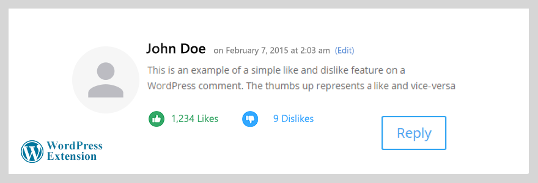

# Comments Like / Dislike WordPress Extension
Enables Like and Dislike functionalities for WordPress Comments



Integrating this API and adding such functionality increases interaction with the WordPress native comments by enabling likes and dislikes buttons. This type of functionality consumes a large amount of bandwidth and puts a lot of demands on the database so the API offloads the overhead to a dedicated server that can be customized through the code.

## How to use
- Put the `comments_like_dislike` directory next to WordPress root directoreis (i.e next to `wp-admin`, `wp-content`, etc; not in the regular "plugin directory").

- In your `comments.php` template, utilize the [`wp_list_comments`](https://developer.wordpress.org/reference/functions/wp_list_comments/) function to specifiy an instance of a [`Walker`](https://developer.wordpress.org/reference/classes/walker/) class to provide us with a means to traverse tree-like data structures for the purpose of rendering comments in HTML:
  ```php
  wp_list_comments( array('walker' => new My_Comment_Walker, ...));
  ```

  An exeprt of such a `Comment_Walker` is as the following:
  ```php
  <?php
  require_once ABSPATH . '/comments_like_dislike/core/comments_like_dislike_core.php';
  
  class My_Comment_Walker extends Walker_Comment {
  
     ...
  
     function start_el( &$output, $comment, $depth, $args, $id = 0 ) {
        ?>
        <?php 
           $client_opinion_on_the_comment = comments_like_dislike::get_opinion_row(get_comment_ID(), $_SERVER['REMOTE_ADDR']);
           $client_already_liked_the_comment = $client_already_disliked_the_comment = false;
           if(!empty($client_opinion_on_the_comment)) {
              $client_already_liked_the_comment = $client_opinion_on_the_comment['opinion'] == comments_like_dislike::OPINION_LIKE;
              $client_already_disliked_the_comment = $client_opinion_on_the_comment['opinion'] == comments_like_dislike::OPINION_DISLIKE;
           }
        ?>
        <span
           id="like_<?php comment_ID(); ?>"
           class="like<?php if($client_already_liked_the_comment) echo ' already-liked'; else if($client_already_disliked_the_comment) echo ' default-cursor'; ?>"
           <?php if(!$client_already_liked_the_comment && !$client_already_disliked_the_comment): ?>onclick="like_comment(<?php comment_ID(); ?>);"<?php endif; ?>
           title="<?php if($client_already_liked_the_comment) echo 'You liked this comment at '. $client_opinion_on_the_comment['insert_date']; else echo $client_already_disliked_the_comment ? '' : 'I like this comment' ;?>"
        >
           <?php echo comments_like_dislike::count_like_opinions(get_comment_ID()); ?>
        </span>
        <span id="comment_like_dislike_ajax_loading_<?php comment_ID(); ?>" class="loading"></span>
        <span
           id="dislike_<?php comment_ID(); ?>"
           class="dislike<?php if($client_already_disliked_the_comment) echo ' already-disliked'; else if($client_already_liked_the_comment) echo ' default-cursor'; ?>" 
           <?php if(!$client_already_liked_the_comment && !$client_already_disliked_the_comment): ?>onclick="dislike_comment(<?php comment_ID(); ?>);"<?php endif; ?>
           title="<?php if($client_already_disliked_the_comment) echo 'You disliked this comment at '.$client_opinion_on_the_comment['insert_date']; else echo $client_already_liked_the_comment ? '' : "I don't like this comment.";?>"
        >
           <?php echo comments_like_dislike::count_dislike_opinions(get_comment_ID()); ?>
        </span><?php
        ...
     } // end of method
     
     ...
  }
  ```
  A complete sample "`Walker`" is also provided on this repository in `comment_walker.php`.

- Lastly, add the following functionality to your JavaScript:
  ```javascript
  function like_comment(comment_id) {
     var comment_like_dislike_ajax_loading_id = '#comment_like_dislike_ajax_loading_'+comment_id;
     jQuery(comment_like_dislike_ajax_loading_id).css("visibility", "visible");
     jQuery.post(
        '/comments_like_dislike/like/',
        {comment_id: comment_id},
        function (data) {
           // alert('data loaded: ' + data);
           var like_span = jQuery('#like_'+comment_id);
           var dislike_span = jQuery('#dislike_'+comment_id);
           like_span.addClass('already-liked');
           dislike_span.addClass('default-cursor');
           like_span.prop('onclick',null).off('click');
           dislike_span.prop('onclick',null).off('click');
           like_span.attr('title', data['insert_date']);
           dislike_span.attr('title', '');
           
           like_span.html(data['likes_count']);
        },
        'json'
     );
     jQuery(comment_like_dislike_ajax_loading_id).css("visibility", "hidden");
  }
  
  function dislike_comment(comment_id) {
     var comment_like_dislike_ajax_loading_id = '#comment_like_dislike_ajax_loading_'+comment_id;
     jQuery(comment_like_dislike_ajax_loading_id).css("visibility", "visible");
     jQuery.post(
        '/comments_like_dislike/dislike/',
        {comment_id: comment_id},
        function (data) { 
           // alert('data loaded: ' + data);
           var like_span = jQuery('#like_'+comment_id);
           var dislike_span = jQuery('#dislike_'+comment_id);
           like_span.addClass('default-cursor');
           dislike_span.addClass('already-disliked');
           like_span.prop('onclick',null).off('click');
           dislike_span.prop('onclick',null).off('click');
           like_span.attr('title', '');
           dislike_span.attr('title', data['insert_date']);
           
           dislike_span.html(data['dislikes_count']);
           
        },
        'json'
     );
     jQuery(comment_like_dislike_ajax_loading_id).css("visibility", "hidden");
  }
  ```

All the code is released to Public Domain. Patches and comments are welcome.
It makes me happy to hear if someone finds the algorithms and the implementations useful.

Ehsan Marufi<br />
<sup>August 2015</sup>